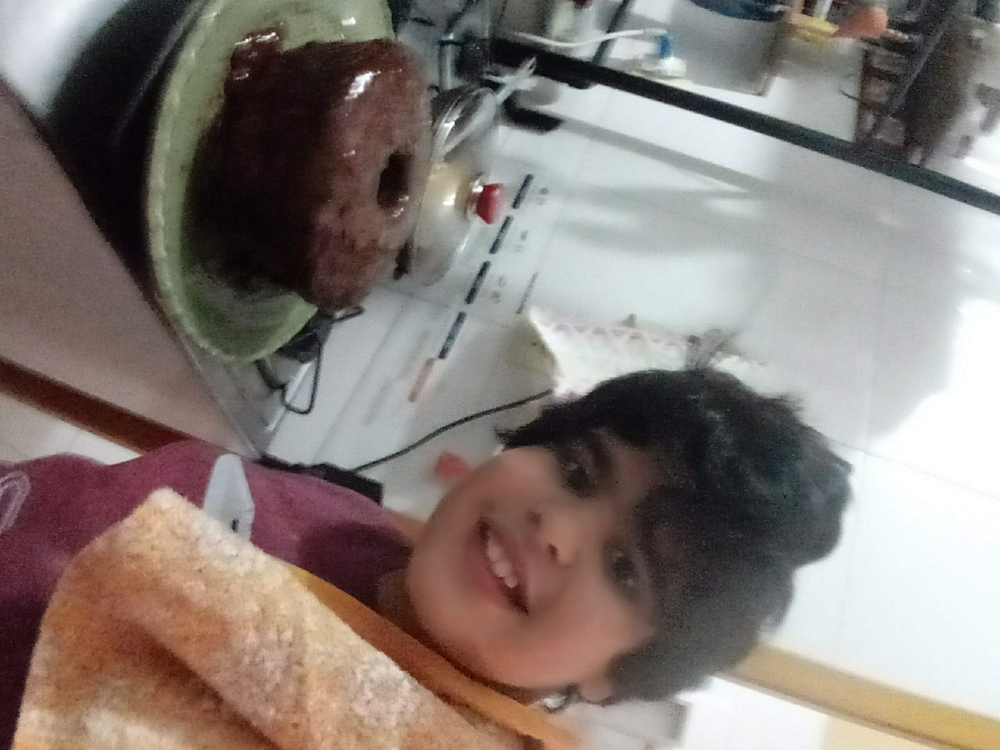

# Introdução
Meu nome é Rian tenho 11 anos e sou [youtuber gamer](https://www.youtube.com/channel/UC17rGqWCWZCaYqCSdwNYZeQ?view_as=subscriber).
 

Sou unschooler.

Além de ser youtuber também faço projetos de robótica, scratch e fanart.
## Cubo de led 
Estou trabalhando num projeto de um cubo de led, trabalhei nele durante 3 meses.

### Codigo
O codigo foi feito no makecode para micro:bit e esta disponivel [aqui](https://makecode.microbit.org/_ERJF1tU7gd7P)

## Scratch

Eu faço projetos no scratch,
veja meus projetos [aqui](https://scratch.mit.edu/users/rian444/)

## Fanart
Eu gosto muito de naruto então fui em busca de um curso de desenho chamado fanart 2.0 (mais ainda não terminei) veja estas imagens:

### Comidas

Eu sou um  bom cozinheiro, e faço um bolo de [chocolate delicioso](https://www.tudogostoso.com.br/receita/34953-bolo-de-chocolate-sem-leite.html)

