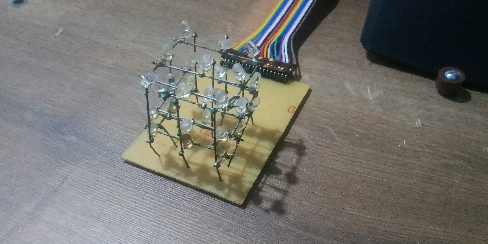
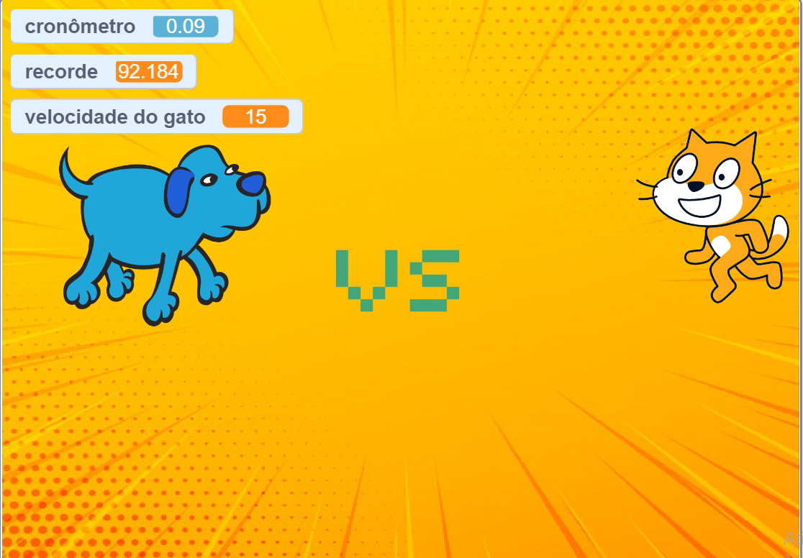
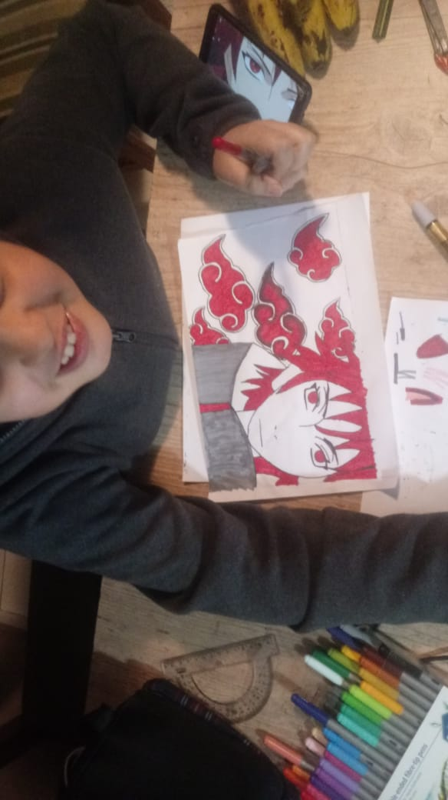

# introdução
aprendendo github.
meu nome é rian tenho 11 anos e sou [youtuber gamer](https://www.youtube.com/channel/UC17rGqWCWZCaYqCSdwNYZeQ?view_as=subscriber).
 alem de ser youtuber tambem mexo com robotica.
## cubo de led 
estou trabalhando num projeto de um cubo de led estou mechendo com ele faz 3 meses.

### codigo
o codigo foi feito no makecode para micro:bit e esta disponivel [aqui](https://makecode.microbit.org/_ERJF1tU7gd7P)

## scratch

eu faço tambem projetos no scratch,
veja meus projetos [aqui](https://scratch.mit.edu/users/rian444/)

## fanart
eu tambem gosto muito de naruto então fui em busca de um curso de desenho chamado fanart 2.0 (mais ainda não terminei) veja estas imagens:

